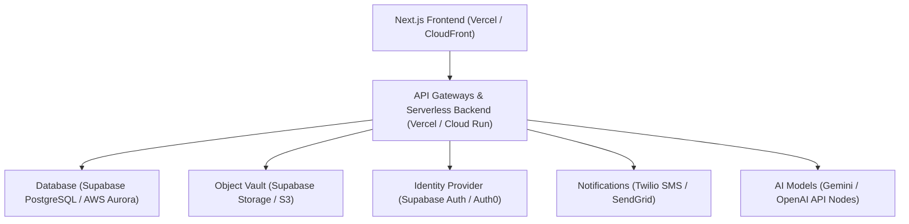

# Infrastructure & AI Cost Estimation Report

This report provides a comprehensive cost model, architecture guide, and scaling roadmap for the **RTIH InnovationOS Platform** (Government of Andhra Pradesh Startup Ecosystem). It outlines the financial investment required to transition the prototype into a production-grade platform.

---

## 1. AI Cost Estimation (API & Token Consumption)

The platform features several AI-assisted mechanisms. The table below models the **token consumption** and **monthly costs** per user using **Google Gemini 2.0 Flash** (Input: \$0.075 / 1M tokens, Output: \$0.30 / 1M tokens) as the baseline provider:

| Feature | Execution Frequency | Avg. Input (Tokens) | Avg. Output (Tokens) | Cost per Run (INR) | Monthly Cost per Founder (INR) |
| :--- | :--- | :--- | :--- | :--- | :--- |
| **AI Copilot (Chat)** | 15 sessions/month (10 messages/session) | 1,500 / message | 350 / message | ₹0.15 / message | ₹22.50 |
| **Milestone / GPS Guidance** | 2 runs/month (upon milestone logs) | 2,500 | 500 | ₹0.03 | ₹0.06 |
| **Mentor Match Engine** | 1 run/month (on onboarding/stage promotion) | 4,000 | 300 | ₹0.04 | ₹0.04 (amortized) |
| **Resume & Profile Parser** | 2 runs/month (profile creation/updates) | 3,000 | 800 | ₹0.04 | ₹0.08 |
| **Opportunity Matching** | 4 runs/month (weekly sync matches) | 3,000 | 400 | ₹0.03 | ₹0.12 |
| **Venture Health Audit** | 1 run/month (monthly diagnostic generation) | 6,000 | 1,000 | ₹0.06 | ₹0.06 |
| **Readiness Scoring** | 1 run/month (admissions board review) | 4,000 | 500 | ₹0.04 | ₹0.04 |
| **Total per Founder** | **—** | **255,000 / month** | **57,500 / month** | **—** | **₹22.90 ($0.275)** |

### Token Consumption Rules of Thumb:
* **Cost per Active Founder**: **~₹23 / month** (using optimized Flash models).
* **Cost per Active Mentor**: **~₹10 / month** (primarily matching evaluations and task drafts).
* **Batch operations**: Daily ecosystem telemetry compilation runs are calculated at **₹2.50 per run** statewide.

---

## 2. Monthly Infrastructure Cost Breakdown

To support production-grade workloads, secure authentication, and a real-time database, we recommend a serverless/SaaS hybrid stack (centered on Supabase and Vercel/AWS Cloud Run):



| Infrastructure Component | Monthly Cost (Pilot) | Monthly Cost (Incubation) | Monthly Cost (State) | Primary Services & Tooling |
| :--- | :--- | :--- | :--- | :--- |
| **Frontend Hosting** | ₹0 (Free Tier) | ₹1,650 ($20) | ₹16,500 ($200) | Vercel Pro / Enterprise |
| **Backend & APIs** | ₹0 (Serverless Free) | ₹2,500 ($30) | ₹25,000 ($300) | AWS Lambda / Google Cloud Run |
| **Database** | ₹0 (Free Tier) | ₹2,060 ($25) | ₹29,000 ($350) | Supabase Managed Postgres (High CPU) |
| **Authentication** | ₹0 (Up to 50k MAU) | ₹0 (Up to 50k MAU) | ₹8,250 ($100) | Supabase Auth / Multi-tenant Auth |
| **File / Document Vault** | ₹0 (Free 1GB) | ₹825 ($10) | ₹12,300 ($150) | AWS S3 with CloudFront CDN caching |
| **Analytics & telemetry** | ₹0 (Free Tier) | ₹2,060 ($25) | ₹16,500 ($200) | Vercel Web Analytics + Mixpanel |
| **Observability & Logging** | ₹0 (Free Tier) | ₹2,060 ($25) | ₹20,500 ($250) | Sentry (Error tracking) + Datadog |
| **Notifications** | ₹825 ($10) | ₹4,120 ($50) | ₹33,000 ($400) | Twilio (SMS alerts) + SendGrid (Emails) |
| **Security & WAF** | ₹0 (Cloudflare Free) | ₹1,650 (Cloudflare Pro) | ₹16,500 (Enterprise) | Cloudflare WAF + SSL + DDoS Shield |
| **Total Infra Cost** | **₹825 / month** | **₹16,925 / month** | **₹1,87,550 / month** | **—** |

---

## 3. Usage & Budget Scenarios

The overall operational budgets (combining AI tokens, infrastructure, and notification gateways) vary dramatically by scale.

### Scenario A: Pilot Deployment (Initial Spoke Rollout)
* **Users**: 100 Founders, 20 Mentors, 5 Managers, 2 Admins
* **Monthly AI Cost**: ₹2,300
* **Monthly Infra Cost**: ₹825 (mostly Free/Starter Tiers)
* **Target Budget**: **₹3,125 / month ($37)**
* *Ideal for MVP verification, startup outpost trials, and initial stakeholder demonstrations.*

### Scenario B: Incubation Scale (Regional Hub Deployment)
* **Users**: 1,000 Founders, 100 Mentors, multiple Incubation Centers
* **Monthly AI Cost**: ₹23,000
* **Monthly Infra Cost**: ₹16,925 (Supabase Pro + Vercel Pro + notifications)
* **Target Budget**: **₹39,925 / month ($480)**
* *Ideal for scaling across 3-5 major regional hubs (e.g., Tirupati, Guntur, Vizag).*

### Scenario C: RTIH State Scale (Statewide Launch)
* **Users**: 10,000 Founders, 1,000 Mentors, statewide management network
* **Monthly AI Cost**: ₹2,29,000 (increases conversational usage)
* **Monthly Infra Cost**: ₹1,87,550 (Enterprise Database, S3 vault, SMS gateways)
* **Target Budget**: **₹4,16,550 / month ($5,000)**
* *Ideal for the official launch under the AP Innovation Society mandate.*

### Scenario D: Vision Scale (Unified Startup Ecosystem)
* **Users**: 20,000+ Active Startups, statewide innovation outpost networks, public linkings
* **Monthly AI Cost**: ₹4,58,000
* **Monthly Infra Cost**: ₹3,50,000 (Multi-Region failover, high availability DB pools)
* **Target Budget**: **₹8,08,000 / month ($9,750)**
* *Ultimate scale, serving as the central tech infrastructure for all government startups in AP.*

---

## 4. AI Provider Comparison & Recommendations

| Provider | Cost Model (per 1M tokens) | Advantages | Limitations | Recommended Stage |
| :--- | :--- | :--- | :--- | :--- |
| **Google Gemini 2.0 Flash** | Input: \$0.075 <br>Output: \$0.30 | • Massive context window (1M+)<br>• Extremely low latency<br>• Safest pricing for government budget | • Lower reasoning depth on highly complex legal clauses | **Primary choice (All Stages)** |
| **OpenAI GPT-4o-mini** | Input: \$0.15 <br>Output: \$0.60 | • Strong general logic<br>• Massive developer ecosystem support | • Higher cost than Gemini Flash<br>• Rate limits are stricter | **Backup choice (Incubation/State)** |
| **Claude 3.5 Sonnet** | Input: \$3.00 <br>Output: \$15.00 | • Unmatched reasoning, coding, and document analysis capability | • 40x more expensive than Gemini Flash | **Hybrid Choice (Use only for complex audits/milestone verification)** |
| **Open-Source (Llama 3.1 70B)** | Host: \$150-\$300/mo (RunPod/Vast.ai) | • Complete data sovereignty<br>• Data never leaves AP State Data Centers | • Maintenance overhead<br>• Need managing GPU clusters | **Enterprise Stage (Required if Gov. mandates local servers)** |

---

## 5. Investor & Scaling Summary

If the RTIH board approves this platform for production deployment:

### 💰 Core Financial Budgets

```
                       [PILOT BUDGET] (Up to 150 Users)
                       ₹3,500 - ₹5,000 / Month
                                  |
                                  v
                     [REGIONAL INCUBATION BUDGET] (Up to 1,200 Users)
                       ₹35,000 - ₹50,000 / Month
                                  |
                                  v
                      [STATEWIDE LAUNCH BUDGET] (10,000+ Users)
                       ₹3.5 - ₹5 Lakhs / Month
```

* **Annual Operating Budget (Pilot)**: **₹60,000 / year**
* **Annual Operating Budget (Incubation)**: **₹4,80,000 / year**
* **Annual Operating Budget (Statewide)**: **₹50,00,000 / year**

### 💡 Executive Recommendation:
1. **Pilot Phase (Month 1-6)**: Budget **₹5,000/month**. Run on **Vercel Pro + Supabase Pro + Gemini 2.0 Flash**. This covers all 100 pilot founders and 20 mentors safely.
2. **Expansion Phase (Month 6-12)**: Budget **₹50,000/month**. Keep Gemini Flash as the primary model, add Claude 3.5 Sonnet strictly for deep milestone evaluation tasks, and scale Supabase connection pools.
3. **Statewide Integration (Month 12+)**: Budget **₹4-5 Lakhs/month**. Transition notifications to high-throughput SMS gateways and scale database configurations on AWS.
